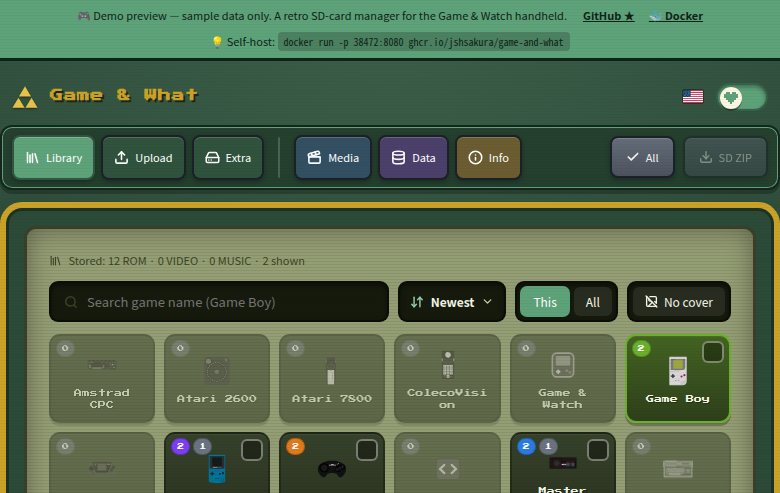
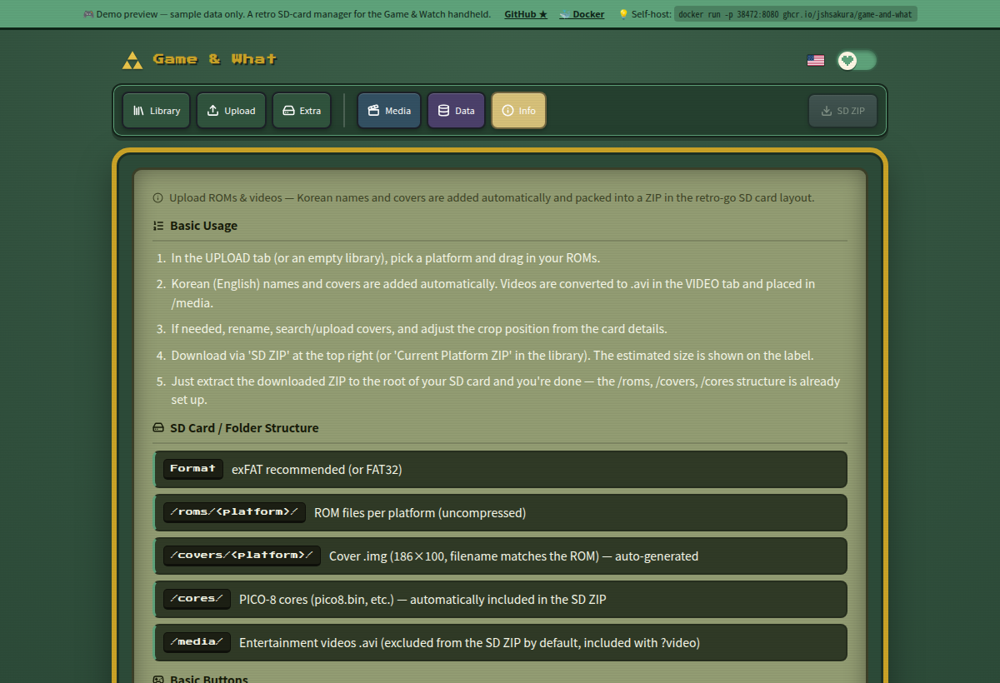
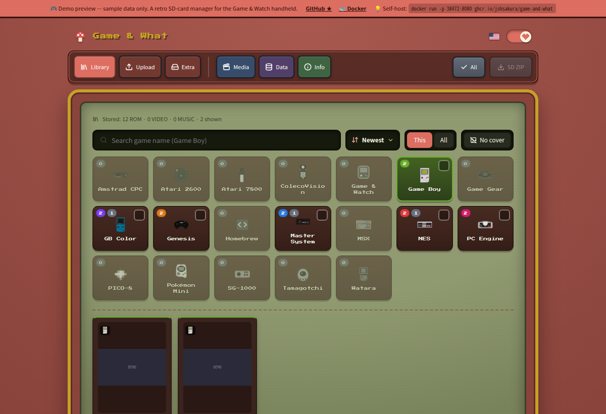

<div align="center">

# 🎮 Game & What — 레트로 SD 매니저

**쌓여 있는 ROM을 곧바로 플래시 가능한 Game & Watch SD 카드로 만들어주는 셀프호스트 웹앱.**

[English](README.md) · **한국어**

[](https://jshsakura.github.io/game-and-what/)
[](https://github.com/jshsakura/game-and-what/pkgs/container/game-and-what)
[](https://github.com/jshsakura/game-and-what/actions/workflows/docker-publish.yml)
[](https://github.com/jshsakura/game-and-what/tags)
[](LICENSE)




</div>

ROM·영상·음악을 올리면 이름과 기기 규격 커버를 자동으로 붙이고, **retro-go SD 카드
레이아웃에 맞춘 단일 ZIP**으로 묶어줍니다. SD 카드에 압축만 풀면 끝입니다.

> Game & Watch 휴대기기의 [retro-go-sd](https://github.com/sylverb/game-and-watch-retro-go-sd)
> 펌웨어를 타깃으로 합니다. 이름 "Game & What"은 말장난이며, 이 프로젝트는
> **ROM·BIOS·저작물을 일절 포함하지 않습니다** ([면책 조항](#-면책-조항) 참조).

**▶︎ [라이브 데모 체험](https://jshsakura.github.io/game-and-what/)** — 샘플 데이터로 보는
정적 미리보기 (백엔드 없음; 업로드·편집은 비활성).

---

## 📑 목차

- [기능](#-기능)
- [동작 원리](#-동작-원리) — 전체 흐름
- [설치 가이드](#-설치-가이드) — **단계별 설치**
  - [1. 준비물](#1-준비물)
  - [2. 실행하기](#2-실행하기-docker)
  - [3. 첫 사용 — ROM에서 SD 카드까지](#3-첫-사용--rom에서-sd-카드까지)
  - [4. 새 버전으로 업데이트](#4-새-버전으로-업데이트)
  - [플랫폼별 참고](#플랫폼별-참고-nas--라즈베리파이--windows)
- [BIOS / 시스템 롬](#-bios--시스템-롬)
- [홈브루 — 필요 파일](#-홈브루--필요-파일)
- [설정](#️-설정)
- [보안 — 내장 로그인 없음](#-보안--내장-로그인-없음)
- [자주 묻는 질문 & 문제 해결](#-자주-묻는-질문--문제-해결)
- [소스에서 개발](#️-소스에서-개발)
- [기술 스택](#-기술-스택) · [크레딧](#-크레딧) · [면책 조항](#-면책-조항) · [라이선스](#-라이선스)

---

## ✨ 기능

- **ROM → 커버.** 지원 시스템의 ROM을 올리면 커버를 자동 검색
  (IGDB → TheGamesDB → SteamGridDB → libretro-thumbnails)해 기기 규격
  (**186×100 `.img`**, 비율 유지)으로 렌더링하고 `/roms/<sys>/이름.<ext>` 옆에
  `/covers/<sys>/이름.img`로 저장합니다. 커버를 직접 검색·업로드·크롭할 수도 있습니다.
- **원클릭 SD ZIP.** 카드 전체(`/roms`, `/covers`, `/cores`, BIOS)를 펌웨어
  레이아웃 그대로 받아 SD 루트에 압축 해제하면 끝.
- **브라우저 플레이.** WASM 코어가 있는 시스템은 페이지 내 에뮬레이션(Nostalgist.js,
  실험적) — 플래시 전에 ROM을 미리 확인.
- **비대해진 세트 큐레이션.** 각 ROM에 **IGDB 평점**(0–100, 커버 위 색상 단계 배지)이
  표시되어 품질을 한눈에 판단할 수 있고, ROM별 **"SD에서 제외"** 토글로 라이브러리에는
  남긴 채 SD 다운로드에서만 빼서 — 삭제 없이 기기 메뉴를 슬림하게.
- **공식 지원 19개 시스템 전부** — 업스트림
  [sylverb 펌웨어](https://github.com/sylverb/game-and-watch-retro-go-sd) **최신
  릴리즈**가 등록하는 기종 전체: NES, 게임보이 / GB 컬러, 게임기어, 마스터시스템,
  제네시스, SG-1000, PC 엔진, 콜레코비전, MSX, 아타리 2600 / 7800, 암스트라드 CPC,
  와타라, 다마고치, 포켓몬 미니, Game & Watch, 홈브루, PICO-8.
- **11개국어 UI** (ko, en, ja, zh-CN, zh-TW, de, es, fr, it, pt, ru, no) — 로케일별
  CJK/키릴 폰트를 필요할 때 지연 로드.
- **선택형 한국어 모드** (`GNW_KOREAN_MODE=true`) — 한글 자동 명명, "한글패치" 플래그,
  관련 필터. **기본 비활성**(국제판 이미지).
- **선택형 실험 모드** (`GNW_EXPERIMENTAL_MODE=true`) — 개인 실험실.
  [jshsakura 포크 펌웨어](https://github.com/jshsakura/game-and-watch-retro-go-sd)
  전용 기능을 켭니다: 아직 업스트림 *릴리즈*에 없는 기종 — 네오지오 포켓, 원더스완,
  버추얼보이, 슈퍼 패미컴, 오디세이², ZX 스펙트럼, C64, Game.com — 슈퍼 메트로이드
  홈브루 포팅, MEDIA 탭(영상 → `/video` MJPEG `.avi`, 음악 → `/music`, 시계 배경).
  *(**PC 엔진 CD**·**아타리 링스**·**게임보이 어드밴스**가 여기 있었습니다. 업스트림
  [v1.4.0](https://github.com/sylverb/game-and-watch-retro-go-sd/releases/tag/v1.4.0)이
  셋 다 등록해서 순정 펌웨어가 읽습니다 → 공식으로 승격. 업스트림은 여전히
  베타/실험으로 표기하지만, 그건 성숙도 얘기지 포크가 필요하다는 뜻이 아닙니다.)*
  **기본 비활성** — 꺼져 있으면 지금 실제로 플래시할 수 있는 펌웨어가 지원하는
  범위만 보입니다.
- 레트로 **픽셀아트 UI**, Zelda ↔ Mario 에디션 토글.

## 🔄 동작 원리

Game & What은 ROM 컬렉션과 SD 카드 사이에 자리합니다. 일반적인 흐름:

```
   내 파일                    Game & What                      SD 카드
 ┌────────────┐   업로드   ┌───────────────────────┐  ZIP  ┌─────────────┐
 │ ROM        │──────────► │ • 자동 명명            │──────►│ /roms       │
 │ (+ 영상,   │            │ • 커버 검색 + 렌더링   │       │ /covers     │
 │  음악,     │            │ • 평점 / 큐레이션      │       │ /cores      │
 │  BIOS)     │            │ • SD에서 제외          │       │ bios/…      │
 └────────────┘            │ • 브라우저 테스트      │       └─────────────┘
                           └───────────────────────┘        카드에 압축 해제
```

1. **업로드** — ROM을 드래그&드롭(또는 폴더째). 앱이 시스템을 감지하고 파일명을
   정규화해 `/roms/<sys>/`에 저장합니다.
2. **커버 아트** — 히트가 있는 첫 제공자에서 받아 기기 규격에 맞춰 렌더링합니다.
   직접 재정의 가능 — 검색·업로드·크롭.
3. **큐레이션** — 평점순 정렬, *SD에서 제외*로 저품질 덤프를 기기에서 숨기기,
   (선택) 브라우저 에뮬레이터로 미리보기.
4. **SD ZIP 다운로드** — 펌웨어의 정확한 디렉터리 레이아웃으로 전부 묶입니다. FAT32
   SD 카드 루트에 압축을 풀고 기기를 부팅하세요.

> 앱은 **카드에 직접 쓰지 않습니다** — ZIP만 건네주고, 압축 해제는 사용자가 합니다.
> 라이브러리(DB + 업로드)는 마운트된 볼륨에 저장되어 재시작·업그레이드에도 남습니다.

## 🚀 설치 가이드

앱은 단일 Docker 이미지(FastAPI 백엔드 + 빌드된 React UI를 한 포트에서)로 배포됩니다.
DB 설정도, 빌드 단계도 없이 — 받아서 실행하면 됩니다.

### 1. 준비물

- **[Docker](https://docs.docker.com/get-docker/)** (Windows/macOS는 Desktop, Linux는
  Engine). 필요한 건 이것뿐입니다.
- **FAT32로 포맷된 microSD 카드**와
  [retro-go-sd](https://github.com/sylverb/game-and-watch-retro-go-sd) 펌웨어가 올라간
  Game & Watch (펌웨어 플래시 자체는 범위 밖 — 해당 프로젝트 가이드 참조).
- **합법적으로 보유한 ROM** (이 프로젝트는 ROM을 제공하지 않습니다).

### 2. 실행하기 (Docker)

**방법 A — 한 줄 실행:**

```bash
docker run -d --name game-and-what \
  -p 38472:8080 \
  -v "$PWD/data:/app/backend/data" \
  --restart unless-stopped \
  ghcr.io/jshsakura/game-and-what:latest
# → http://localhost:38472 접속
```

**방법 B — Docker Compose** (권장; 업데이트·설정이 더 쉬움).
아래를 `docker-compose.yml`로 저장:

```yaml
services:
  game-and-what:
    image: ghcr.io/jshsakura/game-and-what:latest
    container_name: game-and-what
    ports:
      - "38472:8080"          # 호스트:컨테이너 — 왼쪽 값은 자유롭게 변경
    volumes:
      - ./data:/app/backend/data   # 라이브러리 + DB가 여기 저장됨
    environment:
      # 전부 선택 — 없어도 기동됩니다. .env.example / DEPLOY.md 참조.
      IGDB_CLIENT_ID: ""
      IGDB_CLIENT_SECRET: ""
      TGDB_API_KEY: ""
    restart: unless-stopped
```

이후:

```bash
docker compose up -d
# → http://localhost:38472 접속
```

API 키는 필수가 아닙니다 — 없으면 커버 검색만 제한됩니다([설정](#️-설정) 참조).
`./data` 폴더에 전체 라이브러리(SQLite DB + 업로드)가 들어가니, 이 폴더만 백업하면
전부 백업됩니다.

### 3. 첫 사용 — ROM에서 SD 카드까지

1. **`http://localhost:38472`** 접속 (또는 호스트 IP + 포트).
2. **시스템 탭**(예: 게임보이)을 고르고 **ROM을 페이지에 드래그** — 또는 업로드 버튼.
   커버가 자동으로 받아지고 렌더링됩니다.
3. 원하는 만큼 ROM 반복. 놓친 커버는 **검색 / 업로드 / 크롭**으로 보정하고,
   기기에 두기 싫은 건 **SD에서 제외**를 켜세요.
4. **SD ZIP 다운로드** 클릭. 펌웨어 레이아웃 그대로 압축된 아카이브 하나가 받아집니다.
5. **FAT32 SD 카드 루트에 압축 해제** (카드 최상위에 `/roms`, `/covers`, `/cores` 등이
   오도록). 꺼내서 기기에 넣고 전원을 켜면 게임이 들어 있습니다.

> 어떤 시스템에 BIOS가 필요하다면(패미컴 디스크, 콜레코비전, PC엔진 CD…)
> [BIOS / 시스템 롬](#-bios--시스템-롬)을 참조하세요 — 한 번 올려두면 올바른 경로로
> ZIP에 함께 담깁니다.

### 4. 새 버전으로 업데이트

데이터는 마운트된 볼륨에 있으니 업그레이드는 안전합니다:

```bash
# Compose
docker compose pull && docker compose up -d

# 일반 docker run
docker pull ghcr.io/jshsakura/game-and-what:latest
docker rm -f game-and-what
# …그 후 2단계의 `docker run` 명령을 다시 실행
```

이미지는 릴리스별 태그(`:1.8.1`, `:1.8`, `:latest`)가 붙습니다 — 업그레이드를 직접
제어하려면 특정 태그로 고정하세요.

### 플랫폼별 참고 (NAS / 라즈베리파이 / Windows)

- **라즈베리파이 & ARM SBC** — 이미지는 **멀티아치**(`amd64` + `arm64`)라 동일한
  `docker pull`이 그대로 동작합니다. 에뮬레이션 없이 네이티브 ARM.
- **Synology / QNAP NAS** — Container Manager / Container Station에서 이미지를 추가하고,
  호스트 폴더를 `/app/backend/data`에 매핑, 포트 `8080`을 노출하면 됩니다. 여느 컨테이너와 동일.
- **Windows / macOS** — Docker Desktop 사용, 위 명령 그대로. Windows는 PowerShell 또는
  WSL에서 실행하세요(PowerShell에서는 `$PWD`를 `${PWD}`로).
- **파일 소유권 (Linux 호스트)** — 컨테이너가 `./data`에 못 쓰면, UID를 맞춰 빌드하거나
  (`UID=1000 docker compose build`) data 디렉터리를 `chown` 하세요. 자세한 건 [DEPLOY.md](DEPLOY.md).

전체 배포 레퍼런스 — 환경변수·퍼블리싱·Zero-Trust 접근 — 는 **[DEPLOY.md](DEPLOY.md)** 참조.

## 💾 BIOS / 시스템 롬

일부 기종은 저작권 있는 BIOS가 필요해 기본 제공하지 않습니다. 아래 정확한
**SD 경로**로 **추가파일** 탭에 각 파일을 올리세요(정보 탭에도 목록이 있고,
클릭하면 경로가 복사됩니다). 그러면 그 경로 그대로 SD ZIP에 담기고, **실기
펌웨어와 브라우저 플레이어 모두** 여기서 읽어 옵니다. BIOS는 직접 준비해야
하며, 아래 용량은 표준 크기입니다.

| 기종 | SD 경로 (업로드 위치) | 용량 | 비고 |
|------|----------------------|------|------|
| 패미컴 디스크 시스템 | `bios/nes/disksys.rom` | 8 KB | `.fds` 디스크 이미지에만 필요, `.nes` 카트리지는 불필요. |
| 콜레코비전 | `bios/coleco/coleco.bin` | 8 KB | 시스템 롬 — 모든 게임에 필요. |
| PC엔진 CD | `bios/pce/syscard3.pce` | 256 KB | 시스템 카드 3.0 — 사실상 모든 CD 게임 구동. 펌웨어가 덤프를 검사합니다: md5 `38179df8f4ac870017db21ebcbf53114`. |
| 게임보이 어드밴스 | `bios/gba/gba_bios.bin` | 16 KB | **기기 전용.** gpSP에 오픈소스 BIOS가 내장돼 기본으로 쓰이며, [업스트림](https://github.com/sylverb/game-and-watch-retro-go-sd/releases/tag/v1.4.0)은 오리지널 BIOS를 권장합니다. 브라우저 재생은 mGBA라 HLE로 부팅하며 이 파일이 필요 없습니다. |
| 오디세이² / 비디오팩 | `bios/videopac/o2rom.bin` | 1 KB | o2em 코어용 o2rom 시스템 BIOS. |
| 코모도어 64 | `bios/c64/basic.bin`, `bios/c64/kernal.bin`, `bios/c64/chargen.bin` | 8 / 8 / 4 KB | C64 시스템 롬 3종 (© Commodore). |
| 타이거 Game.com | `bios/gamecom/internal.bin`, `bios/gamecom/external.bin` | 4 / 256 KB | 내부 OS + 외부/커널 롬 (© Tiger). |

> 브라우저 코어가 SD 저장명과 다른 파일명을 찾을 수 있는데(예: 콜레코비전 코어는
> 같은 바이트를 `colecovision.rom`으로 요구), 앱이 자동으로 매핑해 줍니다. 원본
> 목록은 [`frontend/src/bios.js`](frontend/src/bios.js)에 있습니다.

## 🧱 홈브루 — 필요 파일

홈브루 앱(젤다3, 슈퍼 마리오 월드, 셀레스테 …)은 **펌웨어에 함께 빌드**돼 있고,
펌웨어 업데이트가 `/roms/homebrew/`의 자기 몫 파일을 카드에 알아서 깔아줍니다.
**직접 넣을 건 본인 카트에서 나오는 파일 하나뿐** — 즉, 카트만 넣으면 됩니다.

| 앱 | 펌웨어 업데이트가 설치 | 직접 추가 | 만드는 법 |
|----|----------------------|----------|----------|
| 젤다3 | `Zelda 3.bin`, `zelda3.ro` | `zelda3_assets.dat` | 원본 **미국판** `zelda3.sfc` (sha1 `6d4f10a8…`, 해시 검사함) → `make -C external/zelda3 tables/zelda3_assets.dat` |
| 슈퍼 마리오 월드 | `Super Mario World.bin` | `smw_assets.dat` | 원본 **미국판** `smw.sfc` (sha1 `6b47bb75…`) → `make -C external/smw smw_assets.dat` |
| 슈퍼 메트로이드 *(포크 전용)* | `Super Metroid.bin`, `sm.xip` | `sm.smc` | 도구 없음 — **원본 3 MB 일본판 롬 자체**를 실행 중에 읽습니다 |
| 셀레스테 클래식 | `celeste.bin` | — | 추가할 파일 없음 |

직접 넣을 파일은 라이브러리의 해당 카드에서 **데이터 파일 추가/교체**로 올리면 SD ZIP에
함께 담깁니다. 정보(INFO) 탭에 같은 표가 있고 경로는 클릭 복사됩니다. 알아두면 좋은 것:

- **펌웨어 몫의 파일은 라이브러리에 두지 마세요.** `.bin`·`zelda3.ro`·`sm.xip`은 플래시한
  빌드와 한 쌍이라 그 빌드의 주소에 링크돼 있습니다. 펌웨어 업데이트에 맡기세요 —
  여기에 사본을 두면 다음 SD ZIP이 방금 설치된 새 파일을 예전 것으로 덮어씁니다.
- **`.bin` 이름은 바꾸지 마세요.** 펌웨어가 파일명으로 앱을 고르기 때문에, 이름을 바꾸면
  로드는 되지만 아무 앱과도 매칭되지 않습니다. (라이브러리에서 이름 변경을 막아 둡니다.)
- **슈퍼 메트로이드는 플래시 증설이 필요합니다.** 롬을 외장 플래시에 캐시하는데
  3 MB는 순정 1 MB에 들어가지 않습니다.
- 다른 롬(또는 다른 버전 도구)으로 만든 `.dat`은 `Mismatching …_assets.dat`으로 거부되고,
  아예 없으면 화면에 `Missing …_assets.dat`으로 멈춥니다.

> 원본 목록은 [`frontend/src/homebrew.js`](frontend/src/homebrew.js)에 있고, 생성 스크립트와
> 앱별 버튼 매핑은 [펌웨어 README](https://github.com/sylverb/game-and-watch-retro-go-sd#homebrew-ports)에 있습니다.

## 📸 스크린샷

*([라이브 데모](https://jshsakura.github.io/game-and-what/) — 샘플 데이터)*

| 라이브러리 — 시스템별 그리드·커버·원클릭 SD ZIP | 내장 가이드 & SD 규격 레퍼런스 |
|---|---|
|  |  |

**에디션 선택** — UI 전체가 Zelda(초록)와 Mario(빨강) 테마로 리스킨됩니다:



## ⚙️ 설정

**인앱 설정 화면이 없습니다** — 모든 옵션은 환경변수(Docker 관례)입니다. `docker run -e`,
compose `.env`, 또는 로컬 개발용 `backend/.env`로 주입하세요. **기동에 필수 항목은
없습니다.** 키는 시작 시 읽으므로, 변경 후에는 컨테이너를 재생성하세요.
**[`.env.example`](.env.example)** 과 [DEPLOY.md](DEPLOY.md)의 표 참조.

| 변수 | 기본값 | 용도 |
|---|---|---|
| `IGDB_CLIENT_ID` / `IGDB_CLIENT_SECRET` | — | IGDB 커버 검색/자동완성 (무료 Twitch 개발자 앱) |
| `TGDB_API_KEY` | — | TheGamesDB 커버 검색/자동완성 (무료 키, 월 할당량) |
| `STEAMGRIDDB_API_KEY` | — | SteamGridDB 커버 검색 (무료 Bearer 토큰) |
| `GNW_KOREAN_MODE` | `false` | 한국 특화 기능 (한글패치 / 한글명) |
| `GNW_EXPERIMENTAL_MODE` | `false` | "개인 실험실": 포크 펌웨어 전용 — 실험 기종 + MEDIA 탭 |
| `GNW_CORS_ORIGINS` | `*` | CORS 허용 목록 (앱에 인증이 없으니 Zero Trust 앞단 필수) |

> **커버 검색 키가 왜 필요한가요?** 하나도 없으면 libretro-thumbnails로만 대체됩니다.
> 하나라도 추가하면(IGDB는 무료에 커버리지가 넓음) 커버 적중률이 크게 오르고,
> 큐레이션용 IGDB 평점도 받아옵니다.

## 🔒 보안 — 내장 로그인 없음

이 앱은 **인증이 없습니다**(단일 공유 워크스페이스, `CORS=*`). **인터넷에 그대로
노출하지 마세요.** 앞단에 Zero Trust 계층(Cloudflare Tunnel + Access, 또는 Tailscale)을
두세요. 자세한 설정은
[DEPLOY.md](DEPLOY.md#access-control--no-login-use-zero-trust) 참조.

## ❓ 자주 묻는 질문 & 문제 해결

**커버를 못 찾거나 이상해요.**
`IGDB` 키(무료, 넓은 커버리지)를 추가하고 해당 ROM에 커버 검색을 다시 돌리거나,
ROM 카드에서 **검색 / 업로드 / 크롭**으로 직접 지정하세요.

**브라우저에서 게임을 테스트할 수 있나요?**
네 — WASM 코어가 있는 시스템은 페이지 내 에뮬레이션(실험적)을 지원합니다. 플래시
전 빠른 확인용이며, 완전한 플레이 경험용은 아닙니다.

**SD ZIP이 기기에서 동작하지 않아요.**
**FAT32** 카드 **루트**에 압축을 풀었는지(카드 최상위에 `/roms`, `/covers` 등이
오도록), 기기가 [retro-go-sd](https://github.com/sylverb/game-and-watch-retro-go-sd)
펌웨어를 쓰는지 확인하세요. [BIOS](#-bios--시스템-롬)가 필요한 기종은 그게 없으면 안 켜집니다.

**포트 `38472`가 이미 사용 중이에요.**
포트 매핑의 호스트 쪽을 바꾸세요 — `-p 9000:8080` (docker run) 또는 compose의 `ports:`
왼쪽 값. 컨테이너는 내부적으로 항상 `8080`을 리슨합니다.

**컨테이너가 data 폴더에 못 써요 (Linux).**
UID 불일치입니다. 내 UID로 재빌드하거나(`UID=1000 docker compose build`) 마운트한
`data` 디렉터리를 컨테이너 사용자로 `chown` 하세요. [DEPLOY.md](DEPLOY.md) 참조.

**라이브러리는 어디 저장되고 어떻게 백업하나요?**
변경되는 모든 것은 마운트된 볼륨(`./data` → `/app/backend/data`)에 있습니다:
SQLite DB + 모든 업로드. 그 폴더만 복사하면 설치 전체가 백업됩니다.

**README가 "공식 20개"라는데 추가 기종/MEDIA 탭이 보여요.**
`GNW_EXPERIMENTAL_MODE=true`가 켜진 것(사용자 또는 이미지). 포크 펌웨어 실험실이며,
공식 전용 기능만 원하면 끄세요.

## 🛠️ 소스에서 개발

```bash
# 백엔드 — FastAPI :38080
cd backend
python3 -m pip install -r requirements.txt
python3 -m uvicorn app.main:app --host 0.0.0.0 --port 38080

# 프론트엔드 — Vite 개발 서버 :38081 (/api → :38080 프록시)
cd frontend
npm install
npm run dev
# → http://localhost:38081
```

로컬 시크릿은 `backend/.env`에 둡니다 (git 무시, `config.py`가 자동 로드).
백엔드 테스트는 `cd backend && python3 -m pytest`.

## 🧱 기술 스택

- **백엔드:** FastAPI (Python 3.12), SQLite, Pillow, `ffmpeg`.
- **프론트엔드:** React 18 + Vite, lucide-react, Nostalgist.js, Press Start 2P +
  Noto Sans (KR/JP/SC/TC) 폰트.
- **패키징:** 멀티스테이지 Docker (Vite 빌드 → SPA+API를 한 포트로 서빙하는 Python 이미지).
  버전 태그 푸시 시 GitHub Actions가 GHCR에 멀티아치(amd64/arm64) 이미지 발행.

## 🙏 크레딧

- [retro-go-sd](https://github.com/sylverb/game-and-watch-retro-go-sd) (sylverb) —
  이 도구가 타깃하는 펌웨어이자 카드 레이아웃·커버 규격의 출처.
- [retro-go](https://github.com/ducalex/retro-go) (ducalex) — 상위 프로젝트.
- 홈브루 앱에 쓰인 `smw` / `zelda3` 재구현 포트 (snesrev).
- 커버 아트: [IGDB](https://www.igdb.com/), [TheGamesDB](https://thegamesdb.net/),
  [SteamGridDB](https://www.steamgriddb.com/),
  [libretro-thumbnails](https://github.com/libretro-thumbnails).

## ⚖️ 면책 조항

이 프로젝트는 **ROM·BIOS·저작물 게임 에셋을 일절 포함하지 않습니다** — 합법적으로 보유한
파일은 사용자가 직접 제공해야 합니다. "Game & Watch", 게임 타이틀 및 관련 표장은 각
권리자의 상표이며, 본 프로젝트는 닌텐도 또는 어떤 권리자와도 **무관**하며 **승인받지
않았습니다**. 법적으로 사용 권한이 있는 콘텐츠에 한해 사용하세요.

## 📜 라이선스

이 프로젝트의 **자체 소스 코드**는 [MIT](LICENSE) © 2026 jshsakura.

추가로 **서드파티 컴포넌트**(`frontend/public/cores/`의 libretro 에뮬레이터 코어, 시스템
아이콘, 폰트)를 번들하며 이들은 **각자의 라이선스**(GPLv2/GPLv3, zlib, 퍼블릭 도메인,
CC BY 4.0)를 유지합니다. 컴포넌트별 전체 목록과 대응 소스 링크는
**[THIRD-PARTY-NOTICES.md](THIRD-PARTY-NOTICES.md)** 참조.

> ⚠️ **배포물 기준 비상업.** 번들된 **Genesis Plus GX** 코어(제네시스/MD, 마스터시스템,
> 게임기어, SG-1000)는 **비상업** 라이선스입니다. 따라서 **조립·배포된 형태의** 본
> 프로젝트는 상업적으로 사용·재배포할 수 없습니다. MIT는 저작자 자체 코드에만 적용됩니다.
