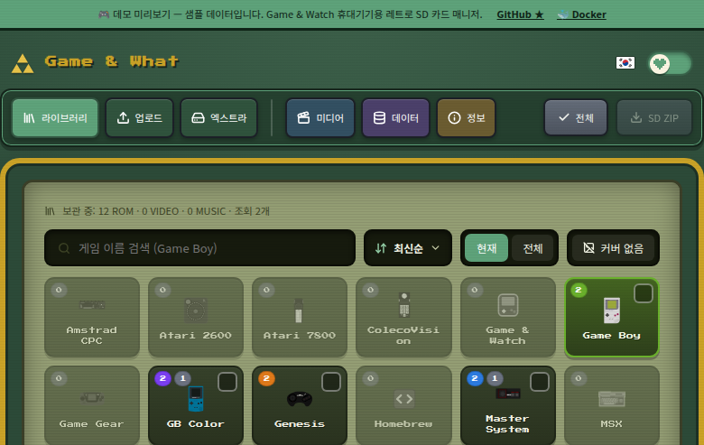

# Game & What — Retro SD Manager

A self-hosted web app that prepares SD cards for **retro-go-sd** firmware on the
Game & Watch handheld. Drop in ROMs, videos and music — it auto-adds names and
device-spec covers, then packs everything into a single ZIP that matches the
retro-go SD card layout. Ready to extract onto your card.

> Targets the [retro-go-sd](https://github.com/sylverb/game-and-watch-retro-go-sd)
> firmware. The name "Game & What" is a play on words — this project ships **no
> ROMs, BIOS or copyrighted assets** (see [Disclaimer](#disclaimer)).

**▶︎ [Live demo](https://jshsakura.github.io/game-and-what/)** — a static preview
with sample data (no backend; uploads/edits are disabled).



---

## What it does

- **ROM → cover.** Upload a ROM for any supported system; a cover is auto-fetched
  (IGDB → TheGamesDB → libretro-thumbnails), rendered to the device spec
  (**186×100 `.img`**, aspect-preserved), and filed as `/covers/<sys>/Name.img`
  beside `/roms/<sys>/Name.<ext>`. Search/upload/crop covers manually too.
- **Video → `/media`.** Re-encodes to the only format the chip's HW JPEG decoder
  accepts — **MJPEG in `.avi`** (320×240, 30 fps, mono) — via `ffmpeg`.
- **Music → `/music`.** MP3 kept as-is (or extracted from video); the firmware's
  Music app reads ID3 tags + album art directly.
- **One-click SD ZIP.** Download the whole card (`/roms`, `/covers`, `/cores`,
  `/media`, `/music`) in the exact firmware layout — extract to the SD root, done.
- **Play in browser.** Experimental in-page emulation (Nostalgist.js) for systems
  that have a WASM core.
- **18 systems:** NES, Game Boy / GB Color, Game Gear, Master System, Genesis,
  SG-1000, PC Engine, ColecoVision, MSX, Atari 2600 / 7800, Amstrad CPC, Watara,
  Tamagotchi, Pokémon Mini, Game & Watch, Homebrew, PICO-8.
- **11-language UI** (ko, en, ja, zh-CN, zh-TW, de, es, fr, it, pt, ru, no) with
  per-locale CJK/Cyrillic fonts lazy-loaded on demand.
- **Optional Korean mode** (`GNW_KOREAN_MODE=true`) — Korean auto-naming, the
  "Korean-patched" flag, and related filters. **Off by default** (international image).
- Retro **pixel-art UI** with a Zelda ↔ Mario edition toggle.

## Quick start (Docker)

```bash
docker run -d --name game-and-what \
  -p 38472:8080 \
  -v "$PWD/data:/app/backend/data" \
  ghcr.io/jshsakura/game-and-what:latest
# → http://localhost:38472
```

Or with compose (`docker compose up -d`). No API keys are required — cover search
is just limited without them. Full deployment guide, env reference, publishing and
**access/security** in **[DEPLOY.md](DEPLOY.md)**.

## Configuration

There is **no in-app settings screen** — everything is an environment variable
(the Docker convention). Provide keys via `docker run -e`, a compose `.env`, or
`backend/.env` for local dev. Nothing is required to boot. See
**[`.env.example`](.env.example)** and the table in [DEPLOY.md](DEPLOY.md).

| Variable | Purpose |
|---|---|
| `IGDB_CLIENT_ID` / `IGDB_CLIENT_SECRET` | IGDB cover search/auto-fill (optional) |
| `TGDB_API_KEY` | TheGamesDB cover search/auto-fill (optional, monthly quota) |
| `GNW_KOREAN_MODE` | Korea-specific features (default `false`) |
| `GNW_CORS_ORIGINS` | CORS allow-list (default `*`) |

## Security — no built-in login

The app has **no authentication** (single shared workspace). **Do not expose it
raw to the internet.** Put a Zero Trust layer in front (Cloudflare Tunnel +
Access, or Tailscale). Details and setup steps in [DEPLOY.md](DEPLOY.md#access-control--no-login-use-zero-trust).

## Develop from source

```bash
# Backend — FastAPI on :38080
cd backend
python3 -m pip install -r requirements.txt
python3 -m uvicorn app.main:app --host 0.0.0.0 --port 38080

# Frontend — Vite dev server on :38081 (proxies /api → :38080)
cd frontend
npm install
npm run dev
# → http://localhost:38081
```

Local secrets go in `backend/.env` (git-ignored, auto-loaded by `config.py`).

## Tech stack

- **Backend:** FastAPI (Python 3.12), SQLite, Pillow, `ffmpeg`.
- **Frontend:** React 18 + Vite, lucide-react, Nostalgist.js, Press Start 2P +
  Noto Sans (KR/JP/SC/TC) fonts.
- **Packaging:** multi-stage Docker (Vite build → Python image serving the SPA +
  API on one port). Multi-arch (amd64/arm64) image published to GHCR via GitHub
  Actions on version tags.

## Credits

- [retro-go-sd](https://github.com/sylverb/game-and-watch-retro-go-sd) (sylverb) —
  the firmware this tool targets, and the source of the card layout & cover spec.
- [retro-go](https://github.com/ducalex/retro-go) (ducalex) — upstream.
- The `smw` / `zelda3` reimplementation ports (snesrev) used by the homebrew apps.
- Cover art: [IGDB](https://www.igdb.com/), [TheGamesDB](https://thegamesdb.net/),
  [libretro-thumbnails](https://github.com/libretro-thumbnails).

## Disclaimer

This project ships **no ROMs, BIOS, or copyrighted game assets** — you supply your
own legally-obtained files. "Game & Watch", game titles and related marks are
trademarks of their respective owners; this project is **unaffiliated** with and
**not endorsed** by Nintendo or any rights holder. Provided for use with content
you are legally entitled to.

## License

This project's **own source code** is [MIT](LICENSE) © 2026 jshsakura.

It **bundles third-party components** (libretro emulator cores under
`frontend/public/cores/`, system icons, fonts) that retain their **own licenses**
— GPLv2/GPLv3, zlib, Public Domain, and CC BY 4.0. See
**[THIRD-PARTY-NOTICES.md](THIRD-PARTY-NOTICES.md)** for the full per-component list
and corresponding-source links.

> ⚠️ **Non-commercial as distributed.** The bundled **Genesis Plus GX** core
> (Genesis/MD, Master System, Game Gear, SG-1000) is under a **non-commercial**
> license. The project **as assembled and distributed** therefore may not be used
> or redistributed commercially. The MIT grant covers the author's own code only.
